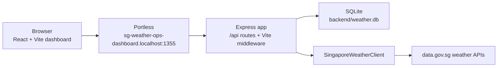

# SG Weather Ops Dashboard

[](https://deepwiki.com/optiflow/sg-weather-ops-dashboard)

SG Weather Ops Dashboard is an AI-assisted full-stack deployment case study for saving Singapore locations, viewing the latest local weather snapshot for each one, and keeping an append-only observation trail for refreshed weather. It is built as an npm workspaces monorepo with a React/Vite dashboard, an Express API, SQLite persistence through Drizzle ORM, and Singapore data.gov.sg weather endpoints.

The project is small enough to study end to end. It still covers practical delivery surfaces: forecast-area location creation, browser geolocation, saved-location labeling and favorites, API validation, external data aggregation, SQLite persistence, refresh behavior, frontend state, responsive UI, local docs, automated tests, and a repeatable quality gate.

## Project Context

This repository was built as part of an [AI Singapore AIxTech](https://aisingapore.org/aixtech/) Programme Assignment. It demonstrates my ability to use agentic AI tools to move a solution from requirements to implementation, documentation, debugging, and verification, combining OpenAI Codex and Claude Code with conventional TypeScript, API, database, and frontend engineering.

For the reviewable delivery narrative, see the [Agentic Delivery Case Study](docs/src/content/docs/guides/agentic-delivery-case-study.md).

## Quick Start

Install dependencies from the repository root:

```bash
npm install
```

The repository targets Node.js 24 and npm 11. Use `.nvmrc` or another version manager to select the Node baseline before installing dependencies.

Start the app:

```bash
npm run dev
```

The root dev command runs Express and Vite middleware in one Node process behind Portless. Open the URL printed by Portless. The default local URL is usually:

```text
http://sg-weather-ops-dashboard.localhost:1355
```

Start the docs site:

```bash
npm run docs
```

Open `http://localhost:4321` or the URL printed by Astro.

Before finishing changes, run the root quality gate:

```bash
npm test
npm run build
npm run docs:build
npm run docs:check
npm run lint
```

## What It Does

- Saves Singapore forecast areas through a primary forecast-area picker.
- Keeps manual coordinate entry as a secondary mode for explicit latitude/longitude testing.
- Adds the nearest Singapore 2-hour forecast area from browser geolocation with **Use my location**.
- Lists, searches, sorts, labels, favorites, selects, refreshes, and deletes saved locations.
- Stores one latest weather snapshot per location in `backend/weather.db`, with refreshed observations retained separately for lightweight history.
- Shows 2-hour forecast text, realtime temperature, humidity, rainfall, wind, UV, PSI, PM2.5, 24-hour forecast periods, and a 4-day outlook.
- Renders a responsive React dashboard with a sidebar, selected-location hero, Weather Risk Brief, Data Trust strip, weather metric tiles, theme switching, and a Leaflet map.
- Keeps detailed architecture, API, schema, component, and configuration docs in the `docs/` workspace.

## Tech Stack

| Layer | Tools |
| --- | --- |
| Frontend | React 18, Vite, Tailwind CSS, Leaflet |
| Backend | Node.js, TypeScript, Express, Pino |
| Persistence | SQLite, Drizzle ORM, generated Drizzle migrations |
| Docs | Astro Starlight, Mermaid diagrams |
| Dev URL | Portless named `.localhost` URL |
| Testing | Vitest, Supertest, Playwright |
| External API | Singapore data.gov.sg weather APIs |

## Architecture



In development, `scripts/dev.mjs` starts the backend with Vite loaded as middleware, so the browser can use relative `/api` requests without a separate frontend proxy. In production, the compiled backend serves `frontend/dist` as static files.

The app still uses the latest snapshot as the primary dashboard read model: saved locations keep the latest persisted weather data, and refresh actions fetch a new snapshot from data.gov.sg. Refreshes also record append-only attempts and weather observations for the history endpoint.

## Common Commands

Run commands from the repository root.

| Command | Purpose |
| --- | --- |
| `npm run dev` | Start the full app through Portless. |
| `npm run docs` | Start the Astro Starlight docs site. |
| `npm run docs:build` | Build the Astro Starlight docs site. |
| `npm run docs:check` | Check local Markdown/MDX links and DeepWiki steering JSON. |
| `npm test` | Run Vitest and Supertest backend tests. |
| `npm run test:e2e` | Run the Playwright smoke test. |
| `npm run test:watch` | Run tests in watch mode. |
| `npm run build` | Build the frontend and compile backend TypeScript. |
| `npm run lint` | Run Biome checks. |
| `npm run format` | Format the repo with Biome. |
| `npm run start` | Run the compiled production server. |
| `npm run doctor` | Verify local health and API behavior. |
| `npm run reset` | Reset local state such as the SQLite database. |
| `npm run db:generate` | Generate Drizzle migrations after schema changes. |
| `npm run db:migrate` | Apply Drizzle migrations. |

See [docs/COMMANDS.md](docs/COMMANDS.md) and [configuration reference](docs/src/content/docs/reference/configuration.md) for the full command and environment reference.

## API Overview

| Method | Endpoint | Purpose |
| --- | --- | --- |
| `GET` | `/health` | Health check. |
| `GET` | `/ready` | Database and migration readiness check that does not call data.gov.sg. |
| `GET` | `/api/forecast-areas` | List sorted canonical Singapore forecast areas. |
| `GET` | `/api/locations` | List saved locations. |
| `POST` | `/api/locations` | Create a location from explicit coordinates. |
| `POST` | `/api/locations/from-area` | Create or select a canonical forecast-area location. |
| `POST` | `/api/locations/from-position` | Add or select the nearest forecast area from browser coordinates. |
| `GET` | `/api/locations/:id` | Get one saved location. |
| `GET` | `/api/locations/:id/history` | List recent persisted weather observations for one location. |
| `PATCH` | `/api/locations/:id` | Update saved-location label and favorite state. |
| `DELETE` | `/api/locations/:id` | Delete a saved location. |
| `POST` | `/api/locations/:id/refresh` | Refresh weather for a saved location. |
| `POST` | `/api/logs` | Record frontend interaction events through the backend logger. |

Full request, response, validation, and error behavior is documented in [API Endpoints](docs/src/content/docs/reference/api-endpoints.md).

## Project Map

```text
sg-weather-ops-dashboard/
|-- backend/        # Express API, SQLite/Drizzle persistence, weather client
|-- frontend/       # React/Vite dashboard, state, components, Leaflet map
|-- docs/           # Astro Starlight documentation site
|-- scripts/        # Dev, start, doctor, and reset orchestration
|-- .agents/        # Repo-local agent skills and code-review role
|-- AGENTS.md       # Agent operating contract for this repo
|-- llms.txt        # Curated guide for LLM and agent readers
|-- package.json    # Root npm workspace scripts
`-- package-lock.json
```

Start with these docs when you need more detail:

- [Project architecture](docs/ARCHITECTURE.md)
- [Getting started guide](docs/src/content/docs/guides/getting-started.md)
- [API reference](docs/src/content/docs/reference/api-endpoints.md)
- [Database schema](docs/src/content/docs/reference/database-schema.md)
- [Frontend components](docs/src/content/docs/reference/frontend-components.md)
- [TypeScript conventions](docs/TYPESCRIPT.md)
- [Theme guidance](docs/THEMES.md)
- [LLM guide](llms.txt)

## External Weather Data

The app reads Singapore weather data from `api-open.data.gov.sg` and `api.data.gov.sg`. It works without an API key for light local usage. Set `WEATHER_API_KEY` if you need higher provider limits:

```bash
export WEATHER_API_KEY=your_api_key_here
npm run dev
```

The weather client aggregates 2-hour forecast data, realtime station readings, UV, PSI, PM2.5, 24-hour forecast periods, and the 4-day outlook. Each snapshot includes `weather.data_quality` so the UI can distinguish refresh coverage and freshness, including unrefreshed, complete, partial, unavailable, fresh, and stale states. Provider details live in [Weather Data](docs/src/content/docs/guides/weather-data.md).

## Future Ideas

- Richer charting on top of the current observation-history endpoint, without adding a charting dependency until the trend view needs it.
