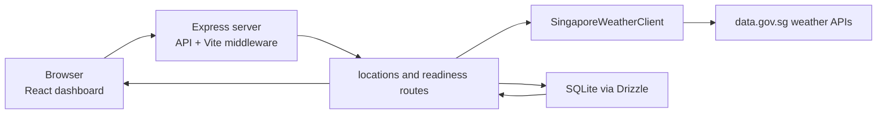

# Project Architecture

The `sg-weather-ops-dashboard` project is a monorepo managed via npm workspaces.

## Workspaces

- **`frontend/`**: A React single-page application.
  - **Tooling**: Vite
  - **Styling**: Tailwind CSS
  - **Mapping**: Leaflet (`react-leaflet`) for interactive weather maps.

- **`backend/`**: A Node.js/Express server.
  - **Database**: SQLite
  - **ORM**: Drizzle ORM (`drizzle-orm`, `drizzle-kit`) for schema management.

- **`scripts/`**: Custom Node.js scripts that manage the development lifecycle (e.g., dev server orchestration, state resets).

- **`docs/`**: An Astro Starlight documentation site.
  - **Tooling**: Astro + `@astrojs/starlight`
  - **Commands**: `npm run docs` starts the dev server on port 4321; `npm run docs:build` builds the static docs site.

## Runtime Flow

In development, the root `npm run dev` command starts Express with Vite middleware through Portless, so the frontend can call relative `/api` routes. In production, the compiled backend serves `frontend/dist` as static SPA assets.

## Location Model

Saved locations are anchored to Singapore forecast areas whenever the user chooses a named area or uses browser geolocation. The forecast-area picker is the primary add path; manual latitude/longitude entry remains available as a secondary mode for explicit coordinate testing.

Each saved location stores:

- Coordinates for the canonical forecast area or manual coordinate.
- Optional `label` copy for the user's own name for the place.
- `is_favorite`, which the frontend uses to keep favorites first while sorting by recent activity or name.
- One latest weather snapshot.
- Append-only refresh attempts and weather observations created by successful or failed refresh flows.

The backend exposes canonical forecast areas through `GET /api/forecast-areas`, creates or selects named areas through `POST /api/locations/from-area`, and updates label/favorite metadata through `PATCH /api/locations/:locationId`.

## Snapshot And History Model

The app stores one latest weather snapshot on each `locations` row. A location is inserted with default `not_refreshed` weather, then create and refresh flows attempt to replace that default snapshot with provider data. The latest snapshot remains the primary dashboard read model.

`WeatherSnapshot` includes `data_quality`, which records the refresh coverage status, refresh time, unavailable provider signals, freshness status, and stale provider signals. Legacy rows and migration defaults use `unknown`; new default rows use `not_refreshed`; provider refreshes classify coverage as `complete`, `partial`, or `unavailable`, and freshness as `fresh` or `stale`.

The frontend treats the persisted snapshot as the source of truth for the main dashboard. `DataTrustStrip` renders `data_quality` directly and owns the refresh control, while `RiskBrief` derives a lightweight decision-support summary from the same snapshot fields plus stale/missing-signal checks. There is no separate risk table, alert provider, auth model, or cloud sync.

Refresh flows also write `refresh_attempts` and `weather_observations`. `GET /api/locations/:locationId/history` exposes recent observations for a minimal trend view, without changing the existing `/api/locations*` response shape.
