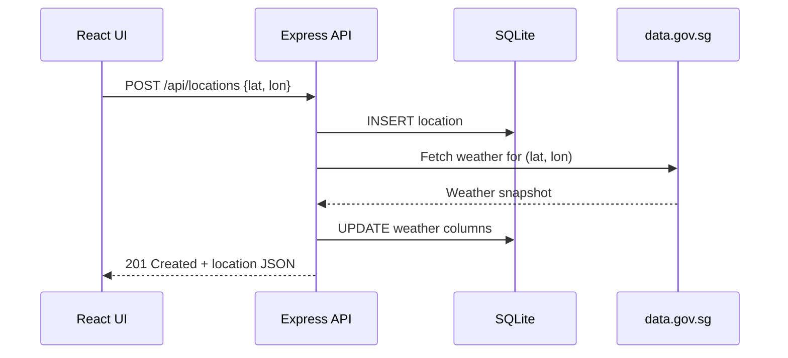
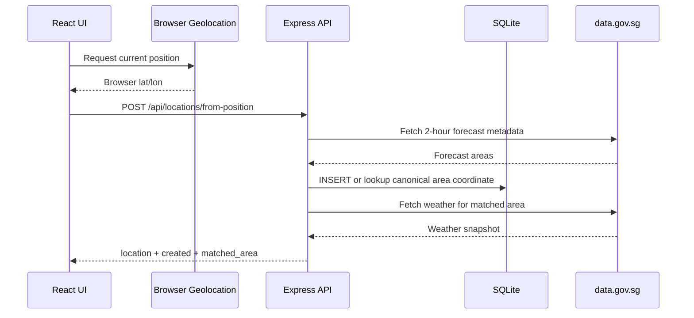

Weather Starter tracks weather for user-saved Singapore coordinates. This guide explains the full lifecycle of a location.

## Creating a Location Manually

1. Click the **+** button in the sidebar.
2. Enter a latitude and longitude within Singapore's bounding box:
   - Latitude: `1.1` – `1.5`
   - Longitude: `103.6` – `104.1`
3. Submit the form.

The frontend sends a `POST /api/locations` request with the coordinates. The backend:

1. Validates the coordinates are within range.
2. Checks for duplicates (same lat/lon pair).
3. Inserts a new row in the `locations` table with default weather.
4. Immediately calls the weather provider to fetch a snapshot.
5. Returns the location with weather data (or default weather if the provider fails).

## Using Browser Location

Click **Use my location** in the sidebar to add the nearest Singapore 2-hour forecast area for your browser position. The browser provides raw coordinates to the backend once; the database stores the matched forecast-area label coordinate instead of the raw browser coordinate.

The backend:

1. Validates the browser coordinates are JSON numbers inside Singapore.
2. Fetches 2-hour forecast metadata from data.gov.sg.
3. Finds the nearest `area_metadata[].label_location`.
4. Returns the existing saved location if that canonical area coordinate is already present.
5. Otherwise saves the canonical area coordinate, refreshes weather, and returns `{ location, created, matched_area }`.

If the weather refresh fails after the canonical area is saved, the location still remains saved with default weather and can be refreshed later.

Local development normally works on `localhost` and `*.localhost` origins. If your browser blocks geolocation over HTTP, run the dev server with `PORTLESS_HTTPS=1 npm run dev`.

If **Use my location** reports that the weather server is unavailable or shows a request failure, open `http://weather-starter.localhost:1355/health`. It should return `{ "status": "healthy" }`; Portless HTML or `No app registered` means the dev server should be restarted with `npm run dev`.

## Refreshing Weather

Click the **Refresh** button on a location's detail view. This calls `POST /api/locations/:id/refresh`, which:

1. Looks up the location's coordinates in SQLite.
2. Fetches fresh data from all data.gov.sg endpoints.
3. Updates the weather columns in the database.
4. Returns the updated location.

If the weather provider is unreachable or rate-limited, the endpoint returns `502 Bad Gateway`.

## Deleting a Location

Click the **×** button on a sidebar card. This sends `DELETE /api/locations/:id`, which removes the row from SQLite. The sidebar re-fetches the location list, and the selection shifts to the first remaining location.

## Searching Locations

The sidebar search box filters the list by area name or weather condition. This is a frontend-only filter — no API call is made.
