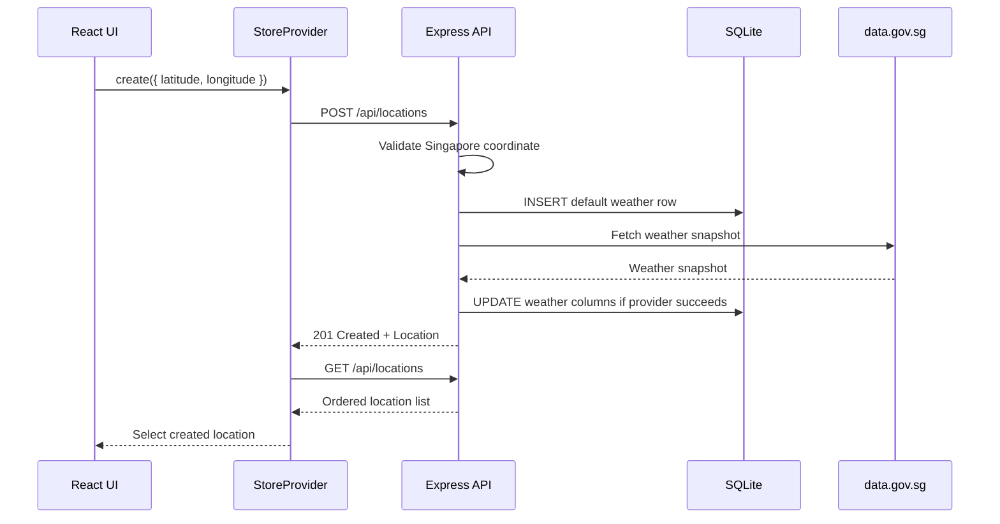

Weather Starter stores saved locations in SQLite and keeps one latest weather snapshot per location. Locations can be created manually from latitude/longitude input or from the browser position through the **Use my location** button.

The backend only accepts coordinates inside the app's Singapore bounding box:

| Coordinate | Accepted range |
| --- | --- |
| Latitude | `1.1` to `1.5` |
| Longitude | `103.6` to `104.1` |

Coordinates must be JSON numbers. Numeric strings such as `"1.35"` are rejected.

## Manual Coordinates

1. Click **Add Location** in the sidebar.
2. Enter a Singapore latitude and longitude.
3. Submit the form. The frontend calls `POST /api/locations`.

The backend then:

1. Validates finite numeric coordinates inside the Singapore range.
2. Inserts the location with default weather (`condition: "Not refreshed"`).
3. Rejects exact duplicate latitude/longitude pairs through the unique database index.
4. Calls `SingaporeWeatherClient.getCurrentWeather(latitude, longitude)`.
5. Updates the row with the returned weather snapshot.
6. Returns the created location.

If the initial weather refresh fails with a provider error, the location is still created and returned with default weather. The user can refresh it later.



### Duplicate Manual Coordinates

Manual duplicates return `409 Conflict`:

```json
{ "detail": "Location already exists" }
```

The duplicate check is exact. The API does not round manual coordinates before persistence.

## Browser Location

Click **Use my location** in the sidebar to add the nearest Singapore 2-hour forecast area for your browser position. The browser provides raw coordinates to the backend once; the database stores the matched forecast-area label coordinate instead of the raw browser coordinate.

The frontend:

1. Calls `navigator.geolocation.getCurrentPosition()`.
2. Uses a 10 second timeout and a 5 minute maximum cached position age.
3. Sends the browser latitude and longitude to `POST /api/locations/from-position`.

The backend:

1. Validates the browser coordinates are JSON numbers inside Singapore.
2. Fetches 2-hour forecast metadata from data.gov.sg.
3. Finds the nearest `area_metadata[].label_location`.
4. Returns the existing saved location if that canonical area coordinate is already present.
5. Otherwise saves the canonical area coordinate, refreshes weather, and returns `{ location, created, matched_area }`.

If the weather refresh fails after the canonical area is saved, the location still remains saved with default weather and can be refreshed later.


Local development normally works on `localhost` and `*.localhost` origins. If your browser blocks geolocation over HTTP, run the dev server with `PORTLESS_HTTPS=1 npm run dev`.

If **Use my location** reports that the weather server is unavailable or shows a request failure, open `http://weather-starter.localhost:1355/health`. It should return `{ "status": "healthy" }`; Portless HTML or `No app registered` means the dev server should be restarted with `npm run dev`.

### Idempotent Forecast-Area Creates

Browser-derived locations are canonicalized to the matched forecast-area coordinate. If two browser positions resolve to the same forecast-area label coordinate, the second request returns the existing saved location and includes:

```json
{ "created": false }
```

The app selects the existing location instead of creating a duplicate.

## Refreshing Weather

Click the **Refresh** button on a location's detail view. This calls `POST /api/locations/:id/refresh`, which:

1. Looks up the location's coordinates in SQLite.
2. Fetches fresh data from all data.gov.sg endpoints.
3. Updates the weather columns in the database.
4. Returns the updated location.

Individual provider failures can still produce a partial or `Unavailable` snapshot. If the weather client rejects outside that settled endpoint flow, the endpoint returns `502 Bad Gateway`.

## Deleting a Location

Hover a sidebar card and click its delete control. The frontend calls `DELETE /api/locations/:id`, then reloads the list. If the deleted location was selected, the store selects the first remaining location or clears the selection when none remain.

Missing locations return `404` with:

```json
{ "detail": "Location not found" }
```

## Searching Locations

The sidebar search box filters the list by area name or weather condition. This is a frontend-only filter — no API call is made.

## Location State in the Frontend

`StoreProvider` owns the location workflow state:

| State | Purpose |
| --- | --- |
| `locations` | Current list from `GET /api/locations`. |
| `selectedId` | Selected location, adjusted when the list changes. |
| `isAdding` | Whether the manual coordinate form is visible. |
| `isLoading` | Initial list load state. |
| `refreshingId` | Location currently being refreshed. |
| `error` | Last store or API error. Geolocation status is local to `UseMyLocationButton`. |

Every create, browser-position create, refresh, and delete action logs a frontend event to `POST /api/logs`. Logging failures are intentionally ignored by the UI.
