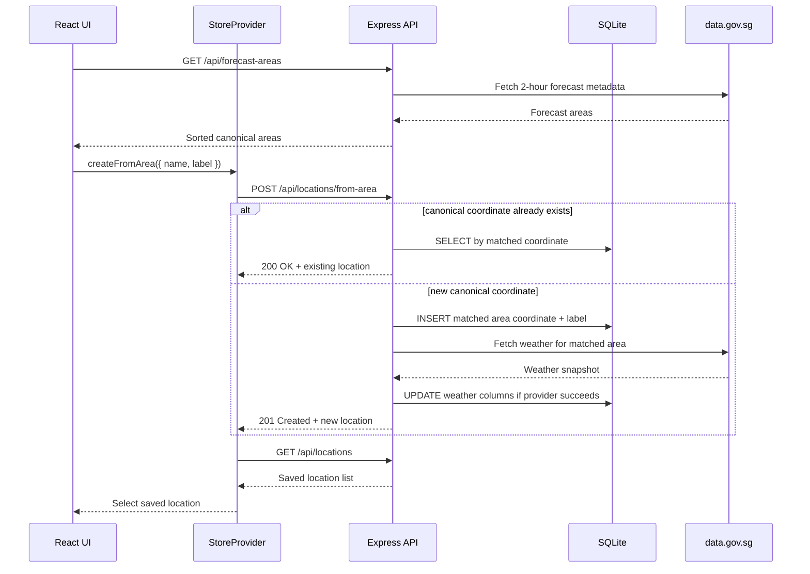
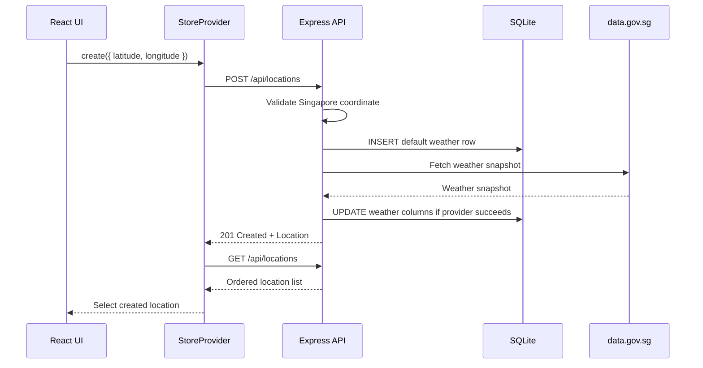
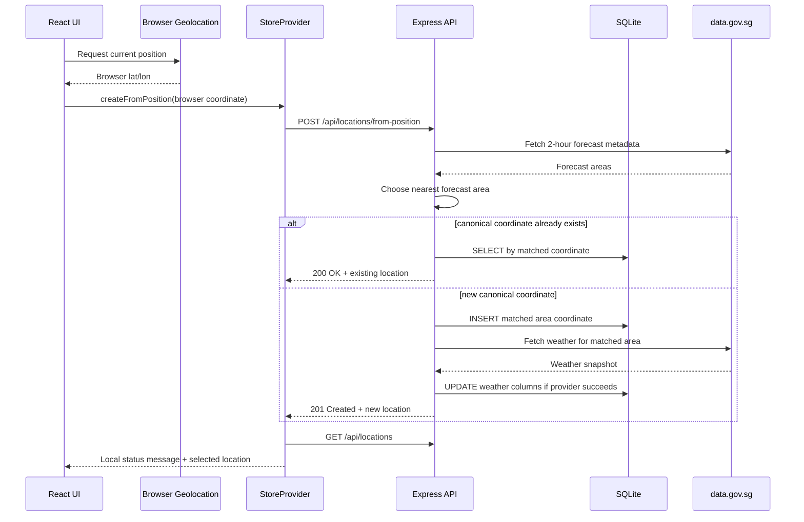

SG Weather Ops Dashboard stores saved locations in SQLite and keeps one latest weather snapshot per location. The primary add path is the forecast-area picker, which saves canonical Singapore 2-hour forecast areas. Manual latitude/longitude entry remains available as a secondary mode for explicit coordinate testing, and **Use my location** resolves the browser position to the nearest canonical forecast area.

The backend only accepts coordinates inside the app's Singapore bounding box:

| Coordinate | Accepted range |
| --- | --- |
| Latitude | `1.1` to `1.5` |
| Longitude | `103.6` to `104.1` |

Coordinates must be JSON numbers. Numeric strings such as `"1.35"` are rejected.

## Forecast-Area Picker

1. Click **Add Location** in the sidebar.
2. Search or choose a Singapore forecast area.
3. Optionally enter a personal label for that saved place.
4. Submit the form. The frontend calls `POST /api/locations/from-area`.

The frontend loads picker options from `GET /api/forecast-areas`. The endpoint returns `{ areas: [...] }`, sorted by canonical 2-hour forecast area name, using the same area names and label coordinates that the backend uses for browser geolocation matching.

The backend then:

1. Validates the submitted `name` against the canonical forecast-area list.
2. Uses the area's `label_location` coordinate as the persisted coordinate.
3. Returns the existing saved location when that canonical coordinate is already present.
4. Otherwise inserts a new location with the optional `label` and default weather (`condition: "Not refreshed"`).
5. Calls `SingaporeWeatherClient.getCurrentWeather(latitude, longitude)`.
6. Updates the row with the returned weather snapshot.
7. Returns `{ location, created, matched_area }`.



If the initial weather refresh fails after the canonical area is saved, the location still remains saved with default weather, `weather.area` is set to the matched forecast-area name, and `weather.data_quality.status` remains `not_refreshed`. Later label or favorite changes use `PATCH /api/locations/:locationId`.

### Idempotent Forecast-Area Creates

Forecast-area creates are canonicalized to the matched area coordinate. If the selected area is already saved, the endpoint returns the existing saved location with:

```json
{ "created": false }
```

The app selects the existing location instead of creating a duplicate. If a `label` is submitted with the area create request, the existing location's label is updated. Favorite changes use `PATCH /api/locations/:locationId`.

## Manual Coordinate Mode

1. Click **Add Location** in the sidebar.
2. Switch to manual coordinate mode.
3. Enter a Singapore latitude and longitude.
4. Submit the form. The frontend calls `POST /api/locations`.

The backend then:

1. Validates finite numeric coordinates inside the Singapore range.
2. Inserts the location with default weather (`condition: "Not refreshed"`).
3. Rejects exact duplicate latitude/longitude pairs through the unique database index.
4. Calls `SingaporeWeatherClient.getCurrentWeather(latitude, longitude)`.
5. Updates the row with the returned weather snapshot.
6. Returns the created location.

If the initial weather refresh fails with a provider error, the location is still created and returned with default weather. The user can refresh it later.



### Duplicate Manual Coordinates

Manual duplicates return `409 Conflict`:

```json
{ "detail": "Location already exists" }
```

The duplicate check is exact. The API does not round manual coordinates before persistence.

## Browser Location

Click **Use my location** in the sidebar to add the nearest Singapore 2-hour forecast area for your browser position. This is a shortcut to the same canonical area model used by the forecast-area picker. The browser provides raw coordinates to the backend once; the database stores the matched forecast-area label coordinate instead of the raw browser coordinate.

The frontend:

1. Calls `navigator.geolocation.getCurrentPosition()`.
2. Uses a 10 second timeout and a 5 minute maximum cached position age.
3. Sends the browser latitude and longitude to `POST /api/locations/from-position`.

The backend:

1. Validates the browser coordinates are JSON numbers inside Singapore.
2. Fetches 2-hour forecast metadata from data.gov.sg.
3. Finds the nearest `area_metadata[].label_location`.
4. Returns the existing saved location if that canonical area coordinate is already present.
5. Otherwise saves the canonical area coordinate, refreshes weather, and returns `{ location, created, matched_area }`.

If the weather refresh fails after the canonical area is saved, the location still remains saved with default weather, `weather.area` is set to the matched forecast-area name, and `weather.data_quality.status` remains `not_refreshed`.



Local development normally works on `localhost` and `*.localhost` origins. If your browser blocks geolocation over HTTP, run the dev server with `PORTLESS_HTTPS=1 npm run dev`.

If **Use my location** reports that the weather server is unavailable or shows a request failure, open `http://sg-weather-ops-dashboard.localhost:1355/health`. It should return `{ "status": "healthy" }`; Portless HTML or `No app registered` means the dev server should be restarted with `npm run dev`.

### Idempotent Browser Creates

Browser-derived locations are canonicalized to the matched forecast-area coordinate. If two browser positions resolve to the same forecast-area label coordinate, the second request returns the existing saved location and includes:

```json
{ "created": false }
```

The app selects the existing location instead of creating a duplicate.

`UseMyLocationButton` keeps browser geolocation status local to the button. It distinguishes added, duplicate, partial weather, unavailable weather, not-refreshed weather, and browser permission/error outcomes.

## Refreshing Weather

Click the **Refresh** button on a location's detail view. This calls `POST /api/locations/:id/refresh`, which:

1. Looks up the location's coordinates in SQLite.
2. Fetches fresh data from all data.gov.sg endpoints.
3. Updates the weather columns in the database.
4. Returns the updated location.

Individual provider failures can still produce a partial or `Unavailable` snapshot. The response includes `weather.data_quality`, which the UI renders in the Data Trust strip. If the weather client rejects outside that settled endpoint flow, the endpoint returns `502 Bad Gateway`.

## Deleting a Location

Hover a sidebar card and click its delete control. The card asks for inline confirmation before the frontend calls `DELETE /api/locations/:id`, then reloads the list. If the deleted location was selected, the store selects the first remaining location or clears the selection when none remain.

Missing locations return `404` with:

```json
{ "detail": "Location not found" }
```

## Saved-Location Metadata

Each saved location includes:

| Field | Purpose |
| --- | --- |
| `label` | Optional user-facing name for the saved place. `null` means the UI falls back to the forecast area or coordinates. |
| `is_favorite` | Boolean favorite flag used by the sidebar to keep favorites first. |

Label and favorite edits call `PATCH /api/locations/:locationId` with:

```json
{ "label": "Office", "is_favorite": true }
```

Send `label: null` to clear a custom label. Omitted fields are left unchanged.

## Searching and Sorting Locations

The sidebar search box is labeled **Search saved locations** for assistive technology. It filters the list by label, forecast area, weather condition, and coordinate text. This is a frontend-only filter, so no API call is made.

Saved locations support **Recent** and **Name** sorting. Favorites always appear before non-favorites within the selected sort mode.

## Location State in the Frontend

`StoreProvider` owns the location workflow state:

| State | Purpose |
| --- | --- |
| `locations` | Current list from `GET /api/locations`. |
| `selectedId` | Selected location, adjusted when the list changes. |
| `isAdding` | Whether the add-location panel is visible. |
| `isLoading` | Initial list load state. |
| `refreshingId` | Location currently being refreshed. |
| `error` | Last store or API error. Geolocation status is local to `UseMyLocationButton`. |

The sidebar owns local search and sort state. Every area create, manual-coordinate create, browser-position create, metadata update, refresh, and delete action logs a frontend event to `POST /api/logs`. Logging failures are intentionally ignored by the UI.
