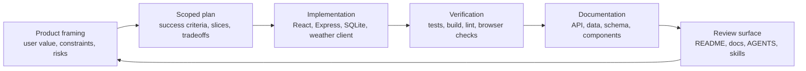

SG Weather Ops Dashboard is a compact case study in using agentic AI tools to deliver a real full-stack product slice. The important claim is not that the product was built autonomously. The claim is that the repo shows a repeatable delivery system: product framing, scoped planning, implementation, tests, docs, and verification.

The project stays small on purpose. It is large enough to show practical product and engineering judgment across frontend, backend, persistence, external API integration, and quality gates, but small enough for reviewers to inspect end to end.

## Case Study Objective

The delivery goal was to turn a Singapore weather-dashboard idea into a working, verifiable product surface:

- Save Singapore locations.
- Refresh current weather from data.gov.sg.
- Persist one latest weather snapshot per location.
- Add browser geolocation without storing raw browser coordinates.
- Keep the implementation understandable to humans and coding agents.

This makes the repository useful as a credential artifact: a reviewer can inspect the product, the code, the docs, the agent instructions, and the verification commands without relying on private chat history.

## Delivery Loop

The loop is intentionally conservative. It favors narrow changes, explicit assumptions, and verifiable acceptance criteria over broad feature expansion.

## Human Product Role

The human product-management role is visible in the constraints that shaped the work:

| Product decision | How it appears in the repo |
| --- | --- |
| Keep scope Singapore-only | API validation rejects coordinates outside the Singapore bounding box. |
| Prefer a clear location model | Browser-derived locations are stored as canonical forecast-area coordinates. |
| Avoid unnecessary data retention | The geolocation flow does not persist raw browser coordinates. |
| Make failures recoverable | Initial weather-refresh failures can leave a saved location with default weather. |
| Keep agent work bounded | `AGENTS.md` and repo skills define how agents should inspect, implement, and verify changes. |
| Prove behavior with checks | Backend tests, docs build, full build, lint, and Playwright smoke coverage exist as reviewable gates. |

This is the product-management value of the case study: the AI tools accelerate execution, but the delivery stays governed by product intent, privacy boundaries, acceptance criteria, and verification.

## Evidence Map

| Evidence | What to inspect |
| --- | --- |
| [README](https://github.com/optiflow/sg-weather-ops-dashboard/blob/main/README.md) | Product context, feature summary, architecture sketch, commands, and project map. |
| [Use my location plan](https://github.com/optiflow/sg-weather-ops-dashboard/blob/main/plans/use-my-location-forecast-area-add.md) | Example of turning a product request into vertical slices and acceptance criteria. |
| [Agent operating contract](https://github.com/optiflow/sg-weather-ops-dashboard/blob/main/AGENTS.md) | Agent-facing rules for assumptions, scope control, verification, docs, and safety. |
| [Repo skills](https://github.com/optiflow/sg-weather-ops-dashboard/tree/main/.agents/skills) | Repeatable workflows for weather features, database migrations, visual QA, and final quality gates. |
| [API Endpoints](/sg-weather-ops-dashboard/reference/api-endpoints/) | Backend request/response contracts and error behavior. |
| [Database Schema](/sg-weather-ops-dashboard/reference/database-schema/) | SQLite and Drizzle persistence model for saved locations and weather snapshots. |
| [Frontend Components](/sg-weather-ops-dashboard/reference/frontend-components/) | React state, component tree, map surface, and location workflows. |
| [Weather Data Pipeline](/sg-weather-ops-dashboard/guides/weather-data/) | data.gov.sg endpoints, weather normalization, partial-failure handling, and rendering flow. |
| [Getting Started](/sg-weather-ops-dashboard/guides/getting-started/) | Local setup, dev server, geolocation notes, and quality-gate commands. |

## What This Demonstrates

This repository demonstrates practical agentic product development when the work is framed as a system, not a single prompt:

- The product surface is small enough to inspect but broad enough to include real integration points.
- The planning artifact captures decisions before code changes.
- The implementation uses ordinary TypeScript, React, Express, SQLite, Drizzle, and Astro docs rather than hidden automation.
- The docs make the architecture and contracts legible to future agents and human reviewers.
- The quality gate creates a repeatable definition of done.

## What It Does Not Claim

This is an AI-assisted delivery case study, not a claim that the app is a production weather-operations platform or that AI independently owned the product. The durable value is the demonstrated workflow: use agents to move faster while keeping human product judgment, explicit constraints, source-backed documentation, and verification in control.
