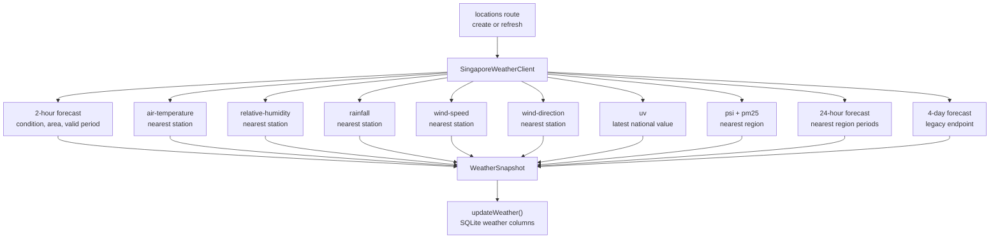

SG Weather Ops Dashboard stores a weather snapshot, not a time series. A snapshot is fetched when a location is created and again when the user refreshes it. The snapshot is persisted in the `locations` row and rendered directly by the frontend.

## Data Pipeline

`SingaporeWeatherClient.getCurrentWeather(latitude, longitude)` merges multiple provider responses into one `WeatherSnapshot`.



## API Endpoints Used

| Endpoint | Base | Provides |
| --- | --- | --- |
| `/v2/real-time/api/two-hr-forecast` | `api-open.data.gov.sg` | Condition text, area name, valid period |
| `/v2/real-time/api/air-temperature` | `api-open.data.gov.sg` | Temperature (°C) |
| `/v2/real-time/api/relative-humidity` | `api-open.data.gov.sg` | Humidity (%) |
| `/v2/real-time/api/rainfall` | `api-open.data.gov.sg` | Rainfall (mm) |
| `/v2/real-time/api/wind-speed` | `api-open.data.gov.sg` | Wind speed (knots) |
| `/v2/real-time/api/wind-direction` | `api-open.data.gov.sg` | Wind direction (degrees) |
| `/v2/real-time/api/uv` | `api-open.data.gov.sg` | UV index |
| `/v2/real-time/api/psi` | `api-open.data.gov.sg` | 24-hour PSI |
| `/v2/real-time/api/pm25` | `api-open.data.gov.sg` | 1-hour PM2.5 |
| `/v2/real-time/api/twenty-four-hr-forecast` | `api-open.data.gov.sg` | Forecast high/low temps, period forecasts |
| `/v1/environment/4-day-weather-forecast` | `api.data.gov.sg` _(legacy)_ | 4-day daily forecast |

The client sends `Accept: application/json`, a `sg-weather-ops-dashboard/0.1 (educational project)` user agent, and `x-api-key` only when `WEATHER_API_KEY` is configured.

## Forecast-Area Matching

The 2-hour forecast endpoint returns named forecast areas in `area_metadata`. Each area includes `label_location.latitude` and `label_location.longitude`.

When the user clicks **Use my location**, the browser sends its current coordinates to `POST /api/locations/from-position`. The backend finds the nearest forecast area using squared Euclidean distance, then stores that area's label coordinate in SQLite. This keeps browser-derived locations canonical and makes duplicate clicks idempotent.

## Nearest-Station Matching

Station-based readings (temperature, humidity, rainfall, wind) include a list of stations with lat/lon coordinates. The client finds the nearest station to the user's saved coordinate using squared Euclidean distance:

```
distance = (stationLat − userLat)² + (stationLon − userLon)²
```

Only stations that have a value in the latest reading are considered.

## Region Matching

Air-quality readings use the region metadata returned by the PSI provider. The client picks the nearest provider region and reads PSI and PM2.5 values for that region.

The 24-hour forecast uses five fixed Singapore regions: `west`, `north`, `central`, `south`, `east`. The client picks the nearest fixed region and reads that region's period forecast.

## Snapshot Shape

The backend and frontend share the same JSON field names for `WeatherSnapshot`:

| Field group | Fields |
| --- | --- |
| 2-hour forecast | `condition`, `observed_at`, `source`, `area`, `valid_period_text` |
| Station readings | `temperature_c`, `humidity_percent`, `rainfall_mm`, `wind_speed_knots`, `wind_direction_degrees` |
| Regional and national readings | `uv_index`, `psi_twenty_four_hourly`, `pm25_one_hourly`, `air_quality_region` |
| 24-hour forecast | `forecast_low_c`, `forecast_high_c`, `forecast_periods[]` |
| 4-day forecast | `daily_forecast[]` |

The database stores scalar fields as SQLite columns and stores `forecast_periods` and `daily_forecast` as JSON text columns through Drizzle's typed JSON mode.

## Partial Failures

Each API call is wrapped in a `settle` helper that catches errors individually. If one endpoint fails, the remaining data is still included in the snapshot — failed fields are set to `null`. This means the dashboard always renders; individual tiles simply show `--` when data is unavailable.

The first 2-hour forecast response supplies the base snapshot. If that forecast fails, the client starts from an `Unavailable` snapshot and still attempts the remaining readings.

`fetchJson` maps provider failures into `WeatherProviderError`:

| Failure | Result |
| --- | --- |
| Timeout | Aborts after 8 seconds by default. |
| HTTP 429 | `Weather provider rate limit reached (HTTP 429)` |
| HTTP 401 or 403 | `Weather provider rejected request (check API key)` |
| Other non-OK HTTP response | `Weather provider returned HTTP <status>` |
| Network or abort failure | `Unable to reach weather provider` |
| Provider JSON with non-zero `code` | Provider `errorMsg` when available. |

The route behavior depends on where the failure occurs:

| Workflow | Provider failure behavior |
| --- | --- |
| Manual create | Keeps the new location with default weather and returns `201`. |
| Browser-position create before area matching | Does not create a location and returns `502`. |
| Browser-position create after saving matched area | Keeps the new canonical location with default weather and returns `201`. |
| Manual refresh | Persists partial or `Unavailable` snapshots for settled endpoint failures. Returns `502` only when the weather client rejects outside that settled endpoint flow. |

## Rendering Data

The frontend renders snapshot fields in these components:

| Component | Data used |
| --- | --- |
| `Hero` | Area, temperature, condition, high/low, observed time, source, refresh action. |
| `HourlyStrip` | `forecast_periods` from the 24-hour regional forecast. |
| `TenDayForecast` | `daily_forecast`; the current provider returns 4 days. |
| `MapCard` | Saved coordinates and temperature/condition markers on Leaflet. |
| `TileGrid` | Air quality, wind, UV, temperature, rainfall, humidity, and forecast high. |
