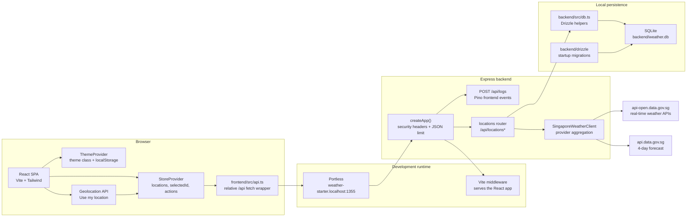

import { Card, CardGrid } from '@astrojs/starlight/components';

## What is Weather Starter?

Weather Starter is an educational full-stack TypeScript app for saving Singapore coordinates and viewing the latest weather snapshot for each saved location. The backend stores locations in SQLite, refreshes weather from Singapore data.gov.sg endpoints, and exposes a small REST API. The frontend renders the saved locations as an interactive weather dashboard with a sidebar, detail view, forecast strips, metric tiles, theme switching, and a Leaflet map.

The app supports two location workflows:

- Manual coordinate entry for any coordinate inside Singapore's configured bounding box.
- Browser geolocation through **Use my location**, which resolves the raw browser position to the nearest 2-hour forecast area before storing the canonical forecast-area coordinate.

The docs site itself is an Astro Starlight workspace under `docs/`.

## Architecture at a Glance

In development, `scripts/dev.mjs` starts `tsx watch backend/src/server.ts` behind Portless. Express owns both the API and the Vite middleware, so the browser can use relative `/api` requests without a separate frontend proxy. In production, the compiled backend serves `frontend/dist` as static files.

## Key Features

<CardGrid stagger>
  <Card title="Weather Snapshots" icon="sun">
    Saves one latest snapshot per location, including 2-hour forecast text, station readings, UV, air quality, 24-hour periods, and 4-day outlook.
  </Card>
  <Card title="Location Workflows" icon="pencil">
    Add coordinates manually, use browser geolocation, refresh a saved location, delete a saved location, and search the sidebar locally.
  </Card>
  <Card title="Dashboard UI" icon="laptop">
    Renders a sidebar, selected-location hero, period forecast strip, 4-day forecast, fullscreen Leaflet map, and weather metric tiles.
  </Card>
  <Card title="Docs Workspace" icon="setting">
    Uses Astro Starlight with Mermaid support for architecture, workflow, data pipeline, component tree, and schema diagrams.
  </Card>
</CardGrid>

## Source Map

The implementation is intentionally small:

| Area | Source |
| --- | --- |
| Express app, security headers, Vite/static serving, frontend logging | `backend/src/server.ts` |
| Location API behavior | `backend/src/routes/locations.ts` |
| SQLite access and Drizzle migration startup | `backend/src/db.ts` |
| Drizzle table and persisted weather fields | `backend/src/schema.ts` |
| data.gov.sg client and provider mapping | `backend/src/weather.ts` |
| React app shell and dashboard components | `frontend/src/App.tsx`, `frontend/src/components/*` |
| Frontend API client and shared data contracts | `frontend/src/api.ts`, `frontend/src/types.ts` |
| Frontend state and theme context | `frontend/src/state/store.tsx`, `frontend/src/state/themeStore.tsx` |
