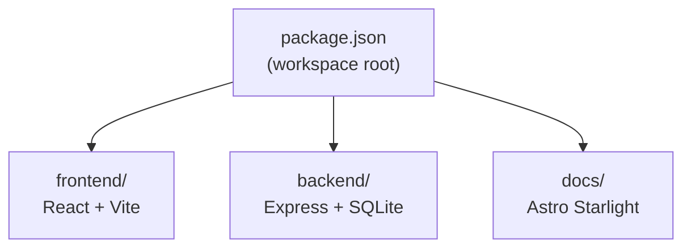

## Monorepo Structure

Weather Starter is an npm workspaces monorepo with three workspaces:

## Root Scripts

Defined in the root `package.json`:

| Script | Command | Description |
| --- | --- | --- |
| `dev` | `node scripts/dev.mjs` | Start dev server (Express + Vite middleware) |
| `build` | `npm run build -w frontend && tsc -p backend/tsconfig.json` | Build both workspaces |
| `start` | `node scripts/start.mjs` | Start production server |
| `docs` | `npm run dev -w docs` | Start Starlight docs site |
| `test` | `vitest run` | Run test suite |
| `test:watch` | `vitest` | Run tests in watch mode |
| `lint` | `eslint .` | Lint with ESLint flat config |
| `format` | `prettier --write .` | Format with Prettier |
| `db:generate` | `drizzle-kit generate` | Generate Drizzle migrations |
| `db:migrate` | `drizzle-kit migrate` | Apply Drizzle migrations |
| `doctor` | `node scripts/doctor.mjs` | Troubleshoot local state |
| `reset` | `node scripts/reset.mjs` | Clean local state |

## TypeScript

Three separate `tsconfig.json` files:

| File | Target | Notes |
| --- | --- | --- |
| `frontend/tsconfig.json` | DOM + ESNext | Used by Vite for the React SPA |
| `backend/tsconfig.json` | Node ESNext | Emits to `backend/dist/` |
| `docs/tsconfig.json` | Astro strict | Extends `astro/tsconfigs/strict` |

The backend uses `tsx` for development (no compile step needed), and `tsc` only for the production build.

## Vite

The frontend Vite config (`frontend/vite.config.ts`) includes:

- `@vitejs/plugin-react` for JSX/React Fast Refresh
- The Vite dev server runs as Express middleware in development (not standalone)

## Drizzle ORM

Configured in `drizzle.config.ts` at the project root:

- **Dialect**: `sqlite`
- **Schema**: `backend/src/schema.ts`
- **Migrations output**: `backend/drizzle/`
- **Database URL**: `DATABASE_PATH` env var or `./backend/weather.db`

## ESLint

Uses the ESLint flat config format (`eslint.config.js`) with:

- `@eslint/js` recommended rules
- `typescript-eslint` recommended rules
- `eslint-plugin-react` + `eslint-plugin-react-hooks` for frontend files
- `eslint-config-prettier` to disable formatting rules
- `docs/**` is excluded from linting (separate Astro config)

## Prettier

Configured in `prettier.config.js`. Formatting ignores are listed in `.prettierignore`.

## Logging

The backend uses [Pino](https://getpino.io/) for structured JSON logging:

- **Output**: Writes to both `stdout` and `backend/logs/app.log`
- **HTTP logging**: Uses `pino-http` middleware (disabled in test)
- **Log level**: Defaults to `info`; set via `LOG_LEVEL` env var; `silent` in test

## Dev Server (Portless)

`scripts/dev.mjs` wraps the backend with [Portless](https://github.com/nicepkg/portless), which provides a stable local URL (`weather-starter.localhost:1355`) regardless of the actual port Express binds to.
