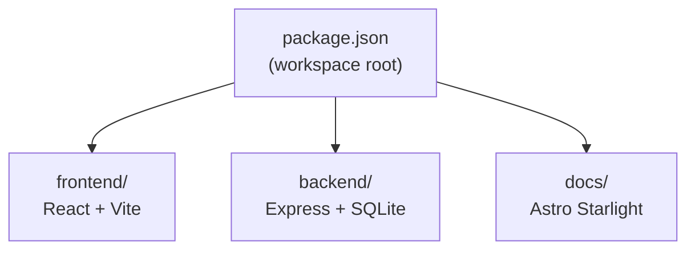

## Monorepo Structure

SG Weather Ops Dashboard is an npm workspaces monorepo with three workspaces:

The root `package-lock.json` covers all workspaces. Do not introduce another package manager.

The root package declares Node.js `>=24 <25`, npm `>=11 <12`, and `packageManager: "npm@11.12.1"`. `.nvmrc` pins the local Node baseline to `24`, and GitHub Actions reads that file through `node-version-file`.

## Root Scripts

Defined in the root `package.json`:

| Script | Command | Description |
| --- | --- | --- |
| `dev` | `node scripts/dev.mjs` | Start dev server (Express + Vite middleware) |
| `build` | `npm run build -w frontend && tsc -p backend/tsconfig.json` | Build both workspaces |
| `start` | `node scripts/start.mjs` | Start production server |
| `docs` | `npm run dev -w docs` | Start Starlight docs site |
| `docs:build` | `npm run build -w docs` | Build Starlight docs site |
| `docs:check` | `node scripts/check-docs.mjs` | Check local docs links and DeepWiki steering JSON |
| `test` | `NODE_OPTIONS=--disable-warning=ExperimentalWarning vitest run` | Run test suite |
| `test:watch` | `NODE_OPTIONS=--disable-warning=ExperimentalWarning vitest` | Run tests in watch mode |
| `lint` | `biome check .` | Lint and format check with Biome |
| `lint:ci` | `biome ci .` | Biome check for CI |
| `format` | `biome format --write .` | Format with Biome |
| `db:generate` | `drizzle-kit generate` | Generate Drizzle migrations |
| `db:migrate` | `tsx backend/src/migrate.ts` | Apply Drizzle migrations |
| `doctor` | `node scripts/doctor.mjs` | Troubleshoot local state |
| `reset` | `node scripts/reset.mjs` | Clean local state |

## Workspace Scripts

| Workspace | Script | Command |
| --- | --- | --- |
| `frontend` | `dev` | `vite --host 127.0.0.1` |
| `frontend` | `build` | `tsc -p tsconfig.json && vite build` |
| `frontend` | `preview` | `vite preview` |
| `backend` | `dev` | `tsx watch src/server.ts` |
| `backend` | `build` | `tsc -p tsconfig.json` |
| `backend` | `start` | `node dist/server.js` |
| `docs` | `dev` / `start` | `astro dev` |
| `docs` | `build` | `astro build` |
| `docs` | `preview` | `astro preview` |

## TypeScript

Three separate `tsconfig.json` files:

| File | Target | Notes |
| --- | --- | --- |
| `frontend/tsconfig.json` | DOM + ESNext | Used by Vite for the React SPA |
| `backend/tsconfig.json` | ES2022 with NodeNext | Emits to `backend/dist/` |
| `docs/tsconfig.json` | Astro strict | Extends `astro/tsconfigs/strict` |

The backend uses `tsx` for development (no compile step needed), and `tsc` only for the production build.

## Vite

The frontend Vite config (`frontend/vite.config.ts`) includes:

- `@vitejs/plugin-react` for JSX/React Fast Refresh
- `@frontman-ai/vite` with the frontend root as the project and source root.

The normal root `npm run dev` flow does not run Vite as a separate process. Express creates a Vite middleware server with:

- `root: frontend`
- `server.middlewareMode: true`
- `appType: "spa"`

`frontend/.env.local.example` exists for standalone frontend proxy configuration, but it is not needed when using the root dev server.

## Drizzle ORM

Configured in `drizzle.config.ts` at the project root:

- **Dialect**: `sqlite`
- **Schema**: `backend/src/schema.ts`
- **Migrations output**: `backend/drizzle/`
- **Database URL**: `DATABASE_PATH` env var or `./backend/weather.db`

## Biome

Uses Biome 2.4.16 through `biome.json` at the root for both linting and formatting:

- Replaces both ESLint and Prettier
- Includes React hook rules
- Configured to mimic Prettier defaults (single quotes, trailing commas)
- `docs/**` is excluded from linting (uses separate Astro config)

Local hooks run `npm run lint` (`biome check .`), while GitHub Actions runs `npm run lint:ci` (`biome ci .`).

## Quality Automation

Lefthook is installed through the root `prepare` script. The hooks are full-repo quality gates, so they intentionally do not use staged-file scoping. The `pre-commit` hook runs Biome and Vitest.

On a fresh clone, run `npx playwright install` before expecting the Playwright smoke test or Lefthook `pre-push` hook to pass locally.

The `pre-push` hook runs the production build, docs build, docs check, and Playwright smoke test. The GitHub Actions quality workflow installs dependencies with `npm ci`, installs the Chromium browser used by Playwright, then runs Vitest, the production build, docs build, docs check, Biome CI, and the Playwright smoke test.

`npm run docs:check` is intentionally conservative and local-only. It scans repository Markdown/MDX links, Starlight route links under `/sg-weather-ops-dashboard/`, and the `.devin/wiki.json` structure. It skips external URLs.

## Astro Starlight Docs

The docs workspace lives under `docs/` and uses:

| Package | Purpose |
| --- | --- |
| `astro` | Docs app runtime and build. |
| `@astrojs/starlight` | Documentation theme and content collections. |
| `astro-mermaid` | Renders Mermaid fenced code blocks. |
| `mermaid` | Diagram renderer used by `astro-mermaid`. |
| `sharp` | Image processing dependency used by Astro. |

`docs/astro.config.mjs` registers Starlight first, then `mermaid()`. The sidebar is explicitly configured with the current guide and reference pages.

## Logging

The backend uses [Pino](https://getpino.io/) for structured JSON logging:

- **Output**: Writes to both `stdout` and `backend/logs/app.log`
- **HTTP logging**: Uses `pino-http` middleware (disabled in test)
- **Log level**: Defaults to `info`; set via `LOG_LEVEL` env var; `silent` in test

## Dev Server (Portless)

`scripts/dev.mjs` wraps the backend with [Portless](https://github.com/nicepkg/portless), which provides a stable local URL (`sg-weather-ops-dashboard.localhost:1355`) regardless of the actual port Express binds to.

`npm run doctor` supports both the normal Portless flow and a direct-server flow. When `SG_WEATHER_OPS_URL` is set, the doctor checks that exact base URL. Otherwise it tries the Portless URL first and then `http://127.0.0.1:${PORT:-3000}`. Each candidate must answer `/health` and `/api/locations`.

Browser geolocation is expected to work on `localhost` and `*.localhost` local origins. If a browser blocks geolocation over HTTP during **Use my location** testing, set `PORTLESS_HTTPS=1` when running `npm run dev`.

## Environment Variables

| Variable | Used by | Purpose |
| --- | --- | --- |
| `WEATHER_API_KEY` | `SingaporeWeatherClient` | Optional provider API key sent as `x-api-key`. |
| `DATABASE_PATH` | `backend/src/db.ts`, `drizzle.config.ts` | SQLite database path. |
| `LOG_LEVEL` | `backend/src/logger.ts` | Pino log level. |
| `LOG_FILE_PATH` | `backend/src/logger.ts` | File path for application logs. |
| `PORT` | `backend/src/server.ts` | Direct Express listen port when running the compiled server manually. |
| `PORTLESS_PORT` | `scripts/dev.mjs` | Stable local Portless port. |
| `PORTLESS_HTTPS` | `scripts/dev.mjs` | Enables local HTTPS through Portless when set to `1`. |
| `SG_WEATHER_OPS_URL` | `scripts/doctor.mjs` | Optional explicit base URL checked by `npm run doctor`; when unset, doctor tries Portless and direct-server defaults. |

## Runtime Modes

| Mode | Behavior |
| --- | --- |
| `NODE_ENV=test` | Disables request logging and frontend serving by default; tests inject a fake weather client and temp database. |
| Development | Express serves API routes and Vite middleware in one process. |
| Production | Express serves static files from `frontend/dist` and falls back to `index.html`. |
