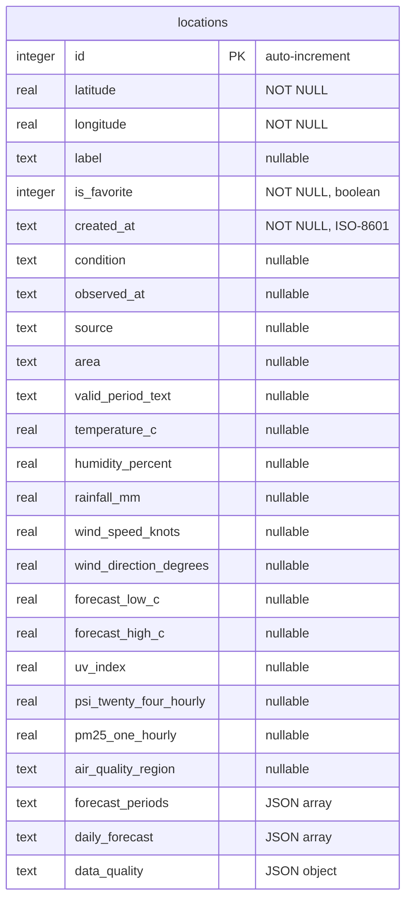
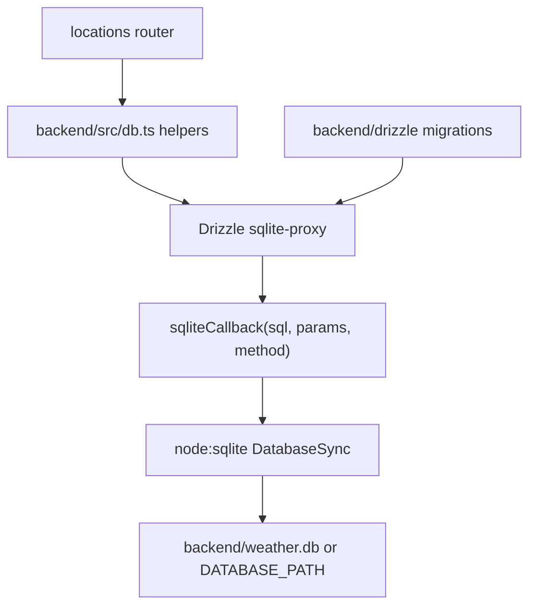

SG Weather Ops Dashboard uses one SQLite database managed through Drizzle ORM. The database file defaults to `backend/weather.db`, or `DATABASE_PATH` when that environment variable is set. `backend/src/db.ts` opens the database with Node's built-in `DatabaseSync`, enables WAL journal mode, and runs Drizzle migrations during module initialization.

## Entity Relationship



## Table: `locations`

`locations` is defined in `backend/src/schema.ts` with Drizzle's `sqliteTable` helper. It combines saved coordinate data, saved-location metadata, and the latest weather snapshot for that coordinate.

### Columns

| Column | SQLite Type | Nullable | Notes |
| --- | --- | --- | --- |
| `id` | `INTEGER` | No | Primary key, auto-increment |
| `latitude` | `REAL` | No | Canonical forecast-area latitude or manual latitude |
| `longitude` | `REAL` | No | Canonical forecast-area longitude or manual longitude |
| `label` | `TEXT` | Yes | Optional user-facing name for the saved location |
| `is_favorite` | `INTEGER` | No | Boolean favorite flag; defaults to `0` / `false` |
| `created_at` | `TEXT` | No | ISO-8601 timestamp |
| `condition` | `TEXT` | Yes | e.g. "Cloudy", "Fair" |
| `observed_at` | `TEXT` | Yes | Latest observation timestamp |
| `source` | `TEXT` | Yes | e.g. "api-open.data.gov.sg" |
| `area` | `TEXT` | Yes | Nearest area name |
| `valid_period_text` | `TEXT` | Yes | e.g. "6.30 pm to 12.30 am" |
| `temperature_c` | `REAL` | Yes | Celsius |
| `humidity_percent` | `REAL` | Yes | Percent |
| `rainfall_mm` | `REAL` | Yes | Millimeters |
| `wind_speed_knots` | `REAL` | Yes | Knots |
| `wind_direction_degrees` | `REAL` | Yes | Degrees (0–360) |
| `forecast_low_c` | `REAL` | Yes | 24-hour forecast low |
| `forecast_high_c` | `REAL` | Yes | 24-hour forecast high |
| `uv_index` | `REAL` | Yes | UV index value |
| `psi_twenty_four_hourly` | `REAL` | Yes | 24-hour PSI reading |
| `pm25_one_hourly` | `REAL` | Yes | 1-hour PM2.5 reading |
| `air_quality_region` | `TEXT` | Yes | Region name for PSI/PM2.5 |
| `forecast_periods` | `TEXT` (JSON) | No | Array of `{ label, forecast }` |
| `daily_forecast` | `TEXT` (JSON) | No | Array of `{ date, forecast, temperature_low_c, temperature_high_c }` |
| `data_quality` | `TEXT` (JSON) | No | `{ status, last_refreshed_at, unavailable_signals }`; migration default is `unknown` |

### Indexes

- **`locations_latitude_longitude_unique`** — Unique index on `(latitude, longitude)` to prevent duplicate locations.

## Default Weather

New rows are inserted with a default snapshot before the backend attempts the initial provider refresh:

| Field | Default |
| --- | --- |
| `label` | `null` |
| `is_favorite` | `false` |
| `condition` | `Not refreshed` |
| `observed_at` | `null` |
| `source` | `not-refreshed` |
| Scalar weather metrics | `null` |
| `forecast_periods` | `[]` |
| `daily_forecast` | `[]` |
| `data_quality.status` | `not_refreshed` |
| `data_quality.last_refreshed_at` | `null` |
| `data_quality.unavailable_signals` | `[]` |

This lets create operations succeed even when the weather provider fails after the location has been saved. Forecast-area creates and browser-position creates still persist the matched area name on `weather.area` when the provider refresh fails after insert.

Migrated legacy rows default `data_quality.status` to `unknown`, because older snapshots did not record provider-signal coverage at refresh time.

## Data Access Flow



## Migrations

Migrations are stored in `backend/drizzle/` and run automatically on server startup via `drizzle-orm/sqlite-proxy/migrator`. The manual `npm run db:migrate` command imports `backend/src/db.ts` through `backend/src/migrate.ts`, so it uses the same runtime migrator path as the server.

### Generate a Migration

After editing `backend/src/schema.ts`:

```bash
npm run db:generate
```

### Apply Migrations

Migrations are applied automatically when the server starts. To run them manually:

```bash
npm run db:migrate
```

## Database Helpers

The `backend/src/db.ts` module exports these async functions:

| Function | Description |
| --- | --- |
| `listLocations()` | Returns all locations in recent order with favorites first |
| `createLocation(lat, lon, options?)` | Inserts a location with optional label and default weather; throws `DuplicateLocationError` on conflict |
| `getLocation(id)` | Returns a single location or `null` |
| `getLocationByCoordinates(lat, lon)` | Returns a saved location by exact latitude/longitude pair or `null` |
| `updateLocationMetadata(id, metadata)` | Updates `label` and/or `is_favorite` for a saved location |
| `updateWeather(id, snapshot)` | Updates weather columns for a location |
| `deleteLocation(id)` | Deletes a location by ID |
| `resetStore()` | Deletes all locations and resets auto-increment |

## Record Mapping

Rows use Drizzle camelCase property names internally, while API JSON uses snake_case. `rowToRecord()` maps each database row into:

```ts
interface LocationRecord {
  id: number;
  latitude: number;
  longitude: number;
  label: string | null;
  is_favorite: boolean;
  created_at: string;
  weather: WeatherSnapshot;
}
```

`weatherToColumns()` performs the reverse mapping when a refreshed `WeatherSnapshot` is persisted.

`normalizeDataQuality()` validates JSON read from SQLite. Unknown statuses or unrecognized signal names are discarded back to the safe `unknown`/empty-signal default instead of leaking malformed persisted JSON to API responses.

## No Historical Readings Table

The current schema intentionally stores one latest weather snapshot per location. Historical readings and trend charts are deferred until the Weather Risk Brief proves useful, because they require a new persistence model for append-only observations, retention, and chart queries rather than more columns on `locations`.
