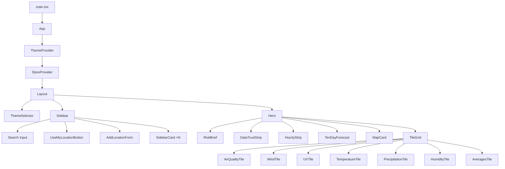
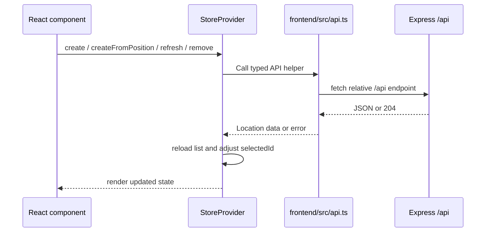

The frontend is a React 18 single-page app built with Vite and Tailwind CSS. It uses React Context for app state and theme state, a small `fetch` wrapper for API calls, and Leaflet through `react-leaflet` for the map.

## Component Tree

## State Management

State is managed through two React Context providers. No external state library is used.

### `StoreProvider` (`state/store.tsx`)

Holds all application state for locations and exposes actions through a `StoreValue` context:

| Field | Type | Description |
| --- | --- | --- |
| `locations` | `Location[]` | All saved locations |
| `selectedId` | `number \| null` | Currently selected location ID |
| `isAdding` | `boolean` | Whether the add-location form is visible |
| `isLoading` | `boolean` | Initial load in progress |
| `refreshingId` | `number \| null` | Location currently being refreshed |
| `error` | `unknown` | Last error, if any |

**Actions:**

| Action | Description |
| --- | --- |
| `select(id)` | Select a location |
| `setAdding(flag)` | Toggle the add-location form |
| `create(payload)` | Create a location via the API |
| `createFromPosition(payload)` | Add/select a canonical forecast-area location from browser coordinates |
| `refresh(id)` | Refresh weather for a location |
| `remove(id)` | Delete a location |

### `ThemeProvider` (`state/themeStore.tsx`)

Manages the active visual theme. The selected theme is persisted in `localStorage` under the key `sg_weather_ops_dashboard_theme`.

Available themes: `apple`, `cotton-candy`, `night-city`, `pixel`, `terminal`.

The provider applies a `theme-{name}` CSS class to `document.body` on change.

## API Flow

The API helper treats non-JSON backend responses as server-unavailable failures, which catches cases where the request accidentally hits a dev proxy or Portless page instead of the Express API.

## Key Components

### `Sidebar`

The left panel that lists all locations as `SidebarCard` components. Includes an accessible search input labeled **Search saved locations** that filters locations by area name or condition, a **Use my location** action, and the `AddLocationForm` for manual coordinate entry.

### `UseMyLocationButton`

Wraps browser geolocation and calls `createFromPosition`. Its status message is local to the button, so permission and browser-position errors do not populate the global sidebar error. Success copy distinguishes newly added, partial, unavailable, not-refreshed, and duplicate forecast-area outcomes.

### `SidebarCard`

Displays area, observation time, condition, temperature, and high/low values for a saved location. Delete uses a lightweight inline confirmation before calling `remove(id)`. The card no longer renders fake **Home** or **My Location** labels; primary-location persistence is out of scope.

### `Hero`

The main content area showing the selected location's weather. Displays:

- Area name and current temperature
- Condition text and high/low forecast
- Observation timestamp and source
- `RiskBrief`
- `DataTrustStrip`
- A **Refresh** button that triggers `POST /api/locations/:id/refresh`

### `RiskBrief`

Builds a frontend-only risk summary from `frontend/src/weatherRisk.ts`. It derives `Low`, `Moderate`, `High`, or `Unavailable` from weather fields and `weather.data_quality`, then shows the most important drivers.

### `DataTrustStrip`

Shows the persisted refresh status, last refresh time, observation time, and unavailable provider signals from `weather.data_quality`.

### `HourlyStrip`

A grid of 24-hour forecast periods with each period's condition text. If no periods are available, it renders a compact unavailable state.

### `TenDayForecast`

Displays `daily_forecast` as a vertical list with daily high/low temperatures and condition text. The current provider data is a 4-day forecast even though the component name is broader.

### `MapCard`

An interactive Leaflet map showing all saved locations as markers. The normal card disables dragging and scroll zoom; an **Expand map** button opens a fullscreen dialog with focus handling, Escape close, and a screen-reader-only list of saved map locations. `MapBoundsUpdater` fits the map bounds to all saved locations with `useEffect`.

### `TileGrid`

A responsive CSS Grid of weather metric tiles:

| Tile | Data Shown |
| --- | --- |
| Air Quality | 24-hr PSI, PM2.5, region, scale bar |
| Wind | Speed (km/h), direction (degrees), compass |
| UV Index | UV value, label (Low–Extreme), scale bar |
| Temperature | Current temperature from nearest station |
| Rainfall | Latest rainfall reading (mm) |
| Humidity | Relative humidity (%) |
| Averages | Forecast high temperature |

## API Client (`api.ts`)

The frontend communicates with the backend through a thin `fetch` wrapper in `src/api.ts`:

| Function | HTTP Method | Endpoint |
| --- | --- | --- |
| `listLocations()` | `GET` | `/api/locations` |
| `createLocation(payload)` | `POST` | `/api/locations` |
| `createLocationFromPosition(payload)` | `POST` | `/api/locations/from-position` |
| `deleteLocation(id)` | `DELETE` | `/api/locations/:id` |
| `refreshLocation(id)` | `POST` | `/api/locations/:id/refresh` |
| `logInteraction(event, metadata)` | `POST` | `/api/logs` |

## Geolocation

`frontend/src/geolocation.ts` wraps the browser Geolocation API. It rejects early when:

- The code is not running in a browser context.
- The origin is not secure and is not a local trusted origin.
- `navigator.geolocation` is unavailable.
- The browser denies, times out, or cannot provide a position.

The returned latitude/longitude is sent to the backend, where it is validated again and canonicalized to the nearest Singapore 2-hour forecast area.

## Styling and Themes

Most layout styling is in Tailwind utility classes. `frontend/src/index.css` defines the base page styles, Leaflet CSS import, and body theme classes:

| Theme | Body class |
| --- | --- |
| Apple | `theme-apple` |
| Cotton Candy | `theme-cotton-candy` |
| Night City | `theme-night-city` |
| Pixel | `theme-pixel` |
| Terminal | `theme-terminal` |

The theme selector writes the selected value to `localStorage` under `sg_weather_ops_dashboard_theme`.
